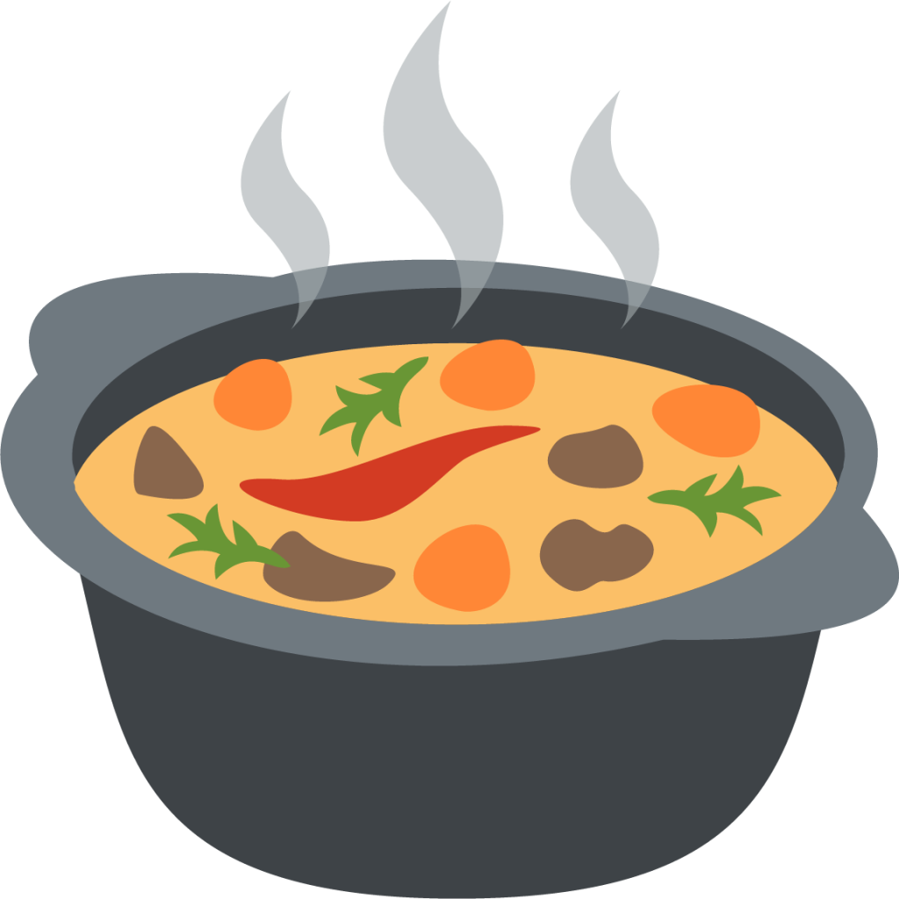
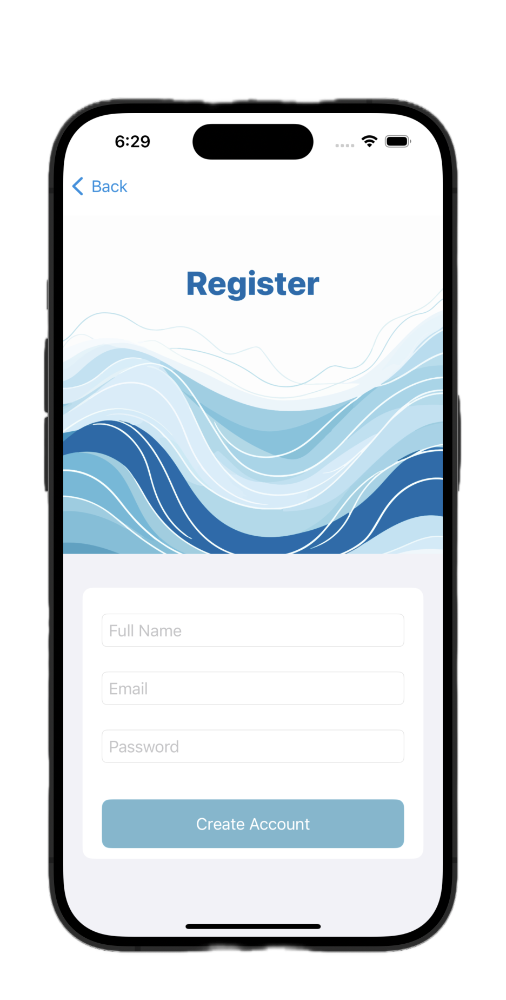
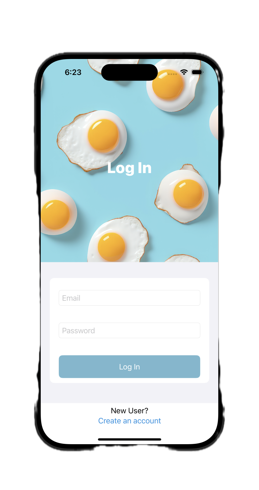
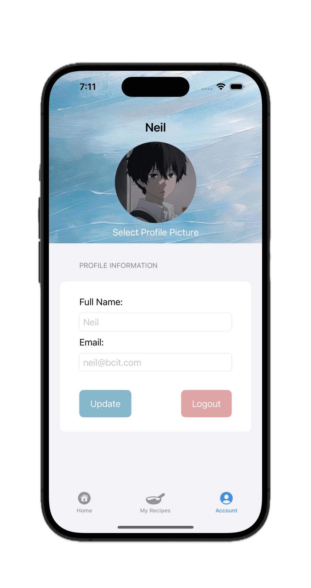
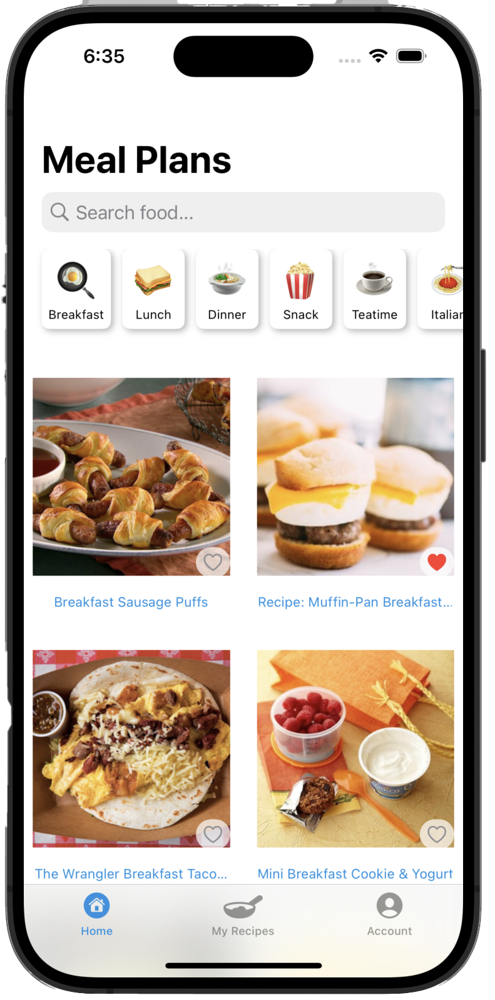
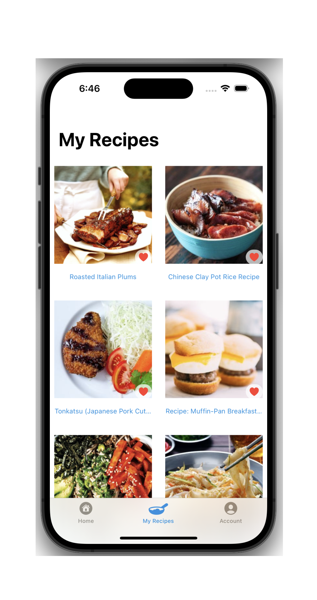
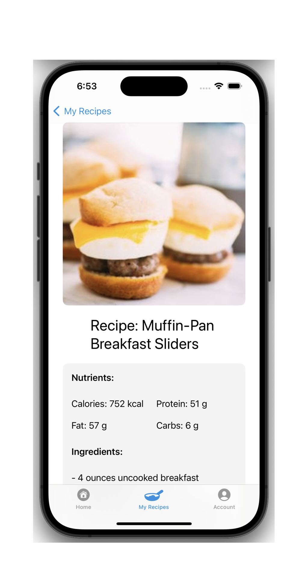

# 🍲 **RecipeYum**

  
 

<em>Delight in Every Bite!</em>

---

## 🌟 **About RecipeYum**

RecipeYum is an innovative iOS app crafted for culinary enthusiasts and home cooks. It’s more than just an app - it's your gateway to a world of flavors and culinary knowledge, offering a plethora of recipes with comprehensive details like calories, nutrients, and step-by-step instructions.

---

## 📱 **Features**

- **🔍 Search and Discover**: Unearth recipes for every mood and moment - from breakfast delights to dinner classics.

- **🍽 Detailed Recipe Insights**: Get calorie counts, nutritional information, and easy-to-follow instructions.

- **👤 Personalized User Experience**: Sign up, set a profile picture, and tailor your food journey.

- **⭐ Favorites**: Bookmark and revisit your beloved recipes anytime.

- **🔄 Manage Your Profile**: Keep your profile up-to-date with ease.

- **🗑 Recipe Management**: Add new finds or remove outdated favorites from your collection.

- **📊 Category-Based Exploration**: Filter recipes by meal times or explore international cuisines like Japanese and Korean.

---

## 📸 **App Screenshots**

  <table class="screenshot-table">
    <tr>
      <td></td>
      <td></td>
      <td></td>
    </tr>
    <tr>
      <td></td>
      <td></td>
      <td></td>
    </tr>
  </table>

---

## 🚀 **Getting Started**

1. **Download**: Find RecipeYum on the iOS App Store.
2. **Sign Up / Log In**: Create a new account or log into an existing one.
3. **Dive In**: Start exploring our extensive database of recipes.
4. **Customize**: Set up your profile and favorites for a personalized experience.
5. **Stay Updated**: Keep your app updated for the latest features and recipes.

---

*Happy Cooking!* 🎉

